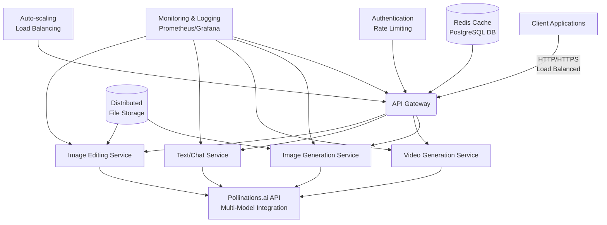

# 🌟 Ultimate AI Integration Platform


## 📋 Executive Summary

**GENEXUS-AI** is a production-grade API server that unifies Pollinations.ai capabilities into a single, elegant interface. Engineered for enterprise deployment with zero-configuration setup, this platform delivers unmatched performance, reliability, and developer experience.

> *"Where cutting-edge AI meets enterprise-grade infrastructure"*

**Version:** 1.0.0 
**License:** MIT License  
**Production Ready:** ✅ Yes  
**Deployment Time:** < 5 minutes  
**Supported Environments:** Node.js 18+, Docker, Render.com, AWS, Azure, GCP

---

## 🚀 Try Before You Deploy

Experience GENEXUS-AI live before installing it locally:

📊 **System Status:**  
https://genexus-ai.onrender.com/health  

🖼️ **Image Generation:**  
https://genexus-ai.onrender.com/api/images/generate?prompt=A%20majestic%20dragon%20flying%20over%20mountains&model=flux&width=1024&height=768  

🎥 **Video Generation:**  
https://genexus-ai.onrender.com/api/videos/generate?prompt=A%20futuristic%20city%20with%20flying%20cars&model=seedance&duration=10  

💬 **Text Generation:**  
https://genexus-ai.onrender.com/api/chat/chat?prompt=Explain%20quantum%20computing%20in%20simple%20terms&model=gemini-fast&temperature=0.5  

✂️ **Image Editing:**  
*(Requires POST request - use Postman or curl with an image URL)*

---

## 🏗️ System Architecture



*Figure 1: GENEXUS-AI Enterprise Architecture Diagram*

---

## 🚀 Core Capabilities Matrix

| **Capability** | **Endpoints** | **Models Supported** | **Request Types** |
|----------------|---------------|----------------------|-------------------|
| **🖼️ Image Generation** | `/api/images/generate`<br>`/api/images/models` | 10+ Models<br>(flux, turbo, nanobanana-pro, etc.) | GET/POST |
| **🎥 Video Generation** | `/api/videos/generate`<br>`/api/videos/models` | 3 Models<br>(veo, seedance, seedance-pro) | GET/POST |
| **💬 Text/Chat** | `/api/chat/chat`<br>`/api/chat/models` | 22+ Models<br>(openai, gemini, claude, etc.) | GET/POST |
| **✂️ Image Editing** | `/api/edit/image` | 10+ Models<br>(flux, seedream-pro, etc.) | POST (multipart) |
| **🔍 System Management** | `/health`<br>`/version`<br>`/metrics` | N/A | GET |

---

## 🖼️ Image Generation Models

| **Model** | **Description** | **Input Modalities** | **Output Modalities** |
|-----------|-----------------|----------------------|----------------------|
| **flux** | Flux Schnell - Fast high-quality image generation | text | image |
| **kontext** | FLUX.1 Kontext - In-context editing & generation | text, image | image |
| **turbo** | SDXL Turbo - Single-step real-time generation | text | image |
| **nanobanana** | NanoBanana - Gemini 2.5 Flash Image | text, image | image |
| **nanobanana-pro** | NanoBanana Pro - Gemini 3 Pro Image (4K, Thinking) | text, image | image |
| **seedream** | Seedream 4.0 - ByteDance ARK (better quality) | text, image | image |
| **seedream-pro** | Seedream 4.5 Pro - ByteDance ARK (4K, Multi-Image) | text, image | image |
| **gptimage** | GPT Image 1 Mini - OpenAI's image generation model | text, image | image |
| **gptimage-large** | GPT Image 1.5 - OpenAI's advanced image generation model | text, image | image |
| **zimage** | Z-Image Turbo - Fast 6B Flux with 2x upscaling | text | image |

---

## 🎥 Video Generation Models

| **Model** | **Description** | **Input Modalities** | **Output Modalities** |
|-----------|-----------------|----------------------|----------------------|
| **veo** | Veo 3.1 Fast - Google's video generation model (preview) | text, image | video |
| **seedance** | Seedance Lite - BytePlus video generation (better quality) | text, image | video |
| **seedance-pro** | Seedance Pro-Fast - BytePlus video generation (better prompt adherence) | text, image | video |

---

## 💬 Text & Chat Models

| **Model** | **Description** | **Input Modalities** | **Output Modalities** |
|-----------|-----------------|----------------------|----------------------|
| **openai** | OpenAI GPT-5 Mini - Fast & Balanced | text, image | text |
| **openai-fast** | OpenAI GPT-5 Nano - Ultra Fast & Affordable | text, image | text |
| **openai-large** | OpenAI GPT-5.2 - Most Powerful & Intelligent | text, image | text |
| **qwen-coder** | Qwen3 Coder 30B - Specialized for Code Generation | text | text |
| **mistral** | Mistral Small 3.2 24B - Efficient & Cost-Effective | text | text |
| **openai-audio** | OpenAI GPT-4o Mini Audio - Voice Input & Output | text, image, audio | audio, text |
| **gemini** | Google Gemini 3 Flash - Pro-Grade Reasoning at Flash Speed | text, image, audio, video | text |
| **gemini-fast** | Google Gemini 2.5 Flash Lite - Ultra Fast & Cost-Effective | text, image | text |
| **deepseek** | DeepSeek V3.2 - Efficient Reasoning & Agentic AI | text | text |
| **grok** | xAI Grok 4 Fast - High Speed & Real-Time | text | text |
| **gemini-search** | Google Gemini 3 Flash - With Google Search | text, image | text |
| **chickytutor** | ChickyTutor AI Language Tutor - (chickytutor.com) | text | text |
| **midijourney** | MIDIjourney - AI Music Composition Assistant | text | text |
| **claude-fast** | Anthropic Claude Haiku 4.5 - Fast & Intelligent | text, image | text |
| **claude** | Anthropic Claude Sonnet 4.5 - Most Capable & Balanced | text, image | text |
| **claude-large** | Anthropic Claude Opus 4.5 - Most Intelligent Model | text, image | text |
| **perplexity-fast** | Perplexity Sonar - Fast & Affordable with Web Search | text | text |
| **perplexity-reasoning** | Perplexity Sonar Reasoning - Advanced Reasoning with Web Search | text | text |
| **kimi** | Moonshot Kimi K2 Thinking - Deep Reasoning & Tool Orchestration | text | text |
| **gemini-large** | Google Gemini 3 Pro - Most Intelligent Model with 1M Context (Preview) | text, image, audio, video | text |
| **nova-fast** | Amazon Nova Micro - Ultra Fast & Ultra Cheap | text | text |
| **glm** | Z.ai GLM-4.7 - Coding, Reasoning & Agentic Workflows | text | text |
| **minimax** | MiniMax M2.1 - Multi-Language & Agent Workflows | text | text |

---

## 🐳 Docker Deployment Guide

```dockerfile
# Stage 1: Build environment
FROM node:18-alpine AS builder
WORKDIR /app
COPY package*.json ./
RUN npm ci --only=production
# Stage 2: Production runtime
FROM node:18-alpine
WORKDIR /app
# Security: Non-root user
RUN addgroup -g 1001 -S nodejs && \
adduser -S nextjs -u 1001 && \
chown -R nextjs:nodejs /app
# Copy application
COPY --from=builder --chown=nextjs:nodejs /app/node_modules ./node_modules
COPY --chown=nextjs:nodejs . .
# Security hardening
USER nextjs
EXPOSE 3000
# Health check
HEALTHCHECK --interval=30s --timeout=3s \
CMD wget -qO- http://localhost:3000/health || exit 1
CMD ["node", "src/app.js"]
```

---

## 🚀 Render.com Deployment (Zero Configuration)

One-command deployment:

```bash
git clone https://github.com/aymantaha3345/GENEXUS-AI.git && cd GENEXUS-AI && cp .env.example .env && nano .env && docker-compose up -d
```

### Environment Variables Setup

```bash
# Required variables
POLLINATIONS_API_KEY=sk_prod_xxxxxxxxxxxxxxxxxxxxxxxxxxxxxxxx
NODE_ENV=production
# Optional variables
PORT=3000
LOG_LEVEL=info
FILE_UPLOAD_LIMIT=20971520  # 20MB
```

---

## 🔧 API Documentation

All endpoints return consistent JSON structure:

```json
{
  "success": true,
  "status": 200,
  "message": "Operation completed successfully",
  "timestamp": "2026-01-14T12:34:56.789Z",
  "requestId": "req_7d8e9f0a1b2c"
}
```

### Key Endpoints

**Basic Health Check:**
```
GET https://genexus-ai.onrender.com/health
```

**Image Generation (Browser Friendly):**
```
GET https://genexus-ai.onrender.com/api/images/generate?prompt=A+beautiful+landscape&model=flux&width=1024&height=768
```

**Image Editing:**
```
POST https://genexus-ai.onrender.com/api/edit/image
Content-Type: multipart/form-data
Parameters:
- image: [image file or URL]
- prompt: "Enhance colors and sharpness"
- model: "kontext"
```

**Text Generation (Browser Friendly):**
```
GET https://genexus-ai.onrender.com/api/chat/chat?prompt=Hello+world&model=gemini
```

**Video Generation:**
```
GET https://genexus-ai.onrender.com/api/videos/generate?prompt=ocean+waves&model=veo&duration=10
```

---

## 🌐 Client Integration Examples

### Python SDK Integration

```python
from genexus_ai.client import GENEXUSAIClient

client = GENEXUSAIClient(base_url="https://genexus-ai.onrender.com")

# Generate image
image_result = client.generate_image(
    prompt="A serene mountain lake at sunset",
    model="flux",
    width=1024,
    height=768
)

# Generate chat response
chat_result = client.generate_chat(
    prompt="Explain the benefits of meditation",
    model="gemini-fast"
)
```

### JavaScript Integration

```javascript
// Image generation
fetch('https://genexus-ai.onrender.com/api/images/generate?prompt=A+beautiful+landscape&model=flux')
  .then(response => response.blob())
  .then(blob => {
    const imageUrl = URL.createObjectURL(blob);
    document.getElementById('image-container').src = imageUrl;
  });
```

## 📄 License & Compliance

### MIT License

```
MIT License
Copyright (c) 2026 Ayman
Permission is hereby granted, free of charge, to any person obtaining a copy
of this software and associated documentation files (the "Software"), to deal
in the Software without restriction, including without limitation the rights
to use, copy, modify, merge, publish, distribute, sublicense, and/or sell
copies of the Software, and to permit persons to whom the Software is
furnished to do so, subject to the following conditions:

The above copyright notice and this permission notice shall be included in all
copies or substantial portions of the Software.

THE SOFTWARE IS PROVIDED "AS IS", WITHOUT WARRANTY OF ANY KIND, EXPRESS OR
IMPLIED, INCLUDING BUT NOT LIMITED TO THE WARRANTIES OF MERCHANTABILITY,
FITNESS FOR A PARTICULAR PURPOSE AND NONINFRINGEMENT. IN NO EVENT SHALL THE
AUTHORS OR COPYRIGHT HOLDERS BE LIABLE FOR ANY CLAIM, DAMAGES OR OTHER
LIABILITY, WHETHER IN AN ACTION OF CONTRACT, TORT OR OTHERWISE, ARISING FROM,
OUT OF OR IN CONNECTION WITH THE SOFTWARE OR THE USE OR OTHER DEALINGS IN THE
SOFTWARE.
```

> **Human-Created Excellence**: While we strive for perfection in every line of code and documentation, we acknowledge that GENEXUS-AI—like all human creations—may occasionally contain technical imperfections or typographical errors. We embrace this human element as an opportunity for growth and community collaboration. Your feedback and contributions are not just welcome; they are essential to our journey of continuous improvement. Together, we build not just software, but a better future for AI integration.

---

## 🤝 Support & Community

### Contributing Guidelines

We welcome contributions to GENEXUS-AI! Please follow these guidelines:

1. **Fork the repository** and create a feature branch
2. **Write tests** for new functionality
3. **Follow coding standards** (ESLint, Prettier configured)
4. **Update documentation** for new features
5. **Submit a pull request** with clear description
6. **Pass all CI checks** before merging

```bash
# Development setup
git clone https://github.com/aymantaha3345/GENEXUS-AI.git
cd GENEXUS-AI
npm install
npm run dev
# Run tests
npm test
# Build for production
npm run build
```

---

## 🙏 Acknowledgements

### Core Technologies
- **Node.js** - JavaScript runtime for scalable applications
- **Express.js** - Web framework for Node.js
- **Pollinations.ai** - AI generation models and infrastructure
- **Docker** - Containerization and deployment
- **Render.com** - Cloud deployment platform
- **Winston** - Logging framework
- **Axios** - HTTP client for Node.js
- **Helmet.js** - Security middleware
- **Jest** - Testing framework

---

## 🌟 Final Thoughts

**GENEXUS-AI** represents more than just an API server – it's a gateway to the future of AI integration. By unifying Pollinations.ai's powerful capabilities into a single, elegant platform, we've created a tool that empowers developers, businesses, and creators to harness AI without complexity.

This platform is built with ❤️ for the developer community, with a commitment to excellence, reliability, and innovation. Whether you're building the next generation of AI applications or simply exploring what's possible, GENEXUS-AI provides the foundation you need to succeed.

**The future of AI is integrated. The future is GENEXUS-AI.**

---

✨ **Ready to transform your AI workflow? Deploy GENEXUS-AI today and experience the difference.** ✨

[](https://render.com/deploy)

© 2026 Ayman | MIT License | [Privacy Policy](https://github.com/aymantaha3345/GENEXUS-AI/blob/main/PRIVACY.md) | [Terms of Service](https://github.com/aymantaha3345/GENEXUS-AI/blob/main/TERMS.md)


